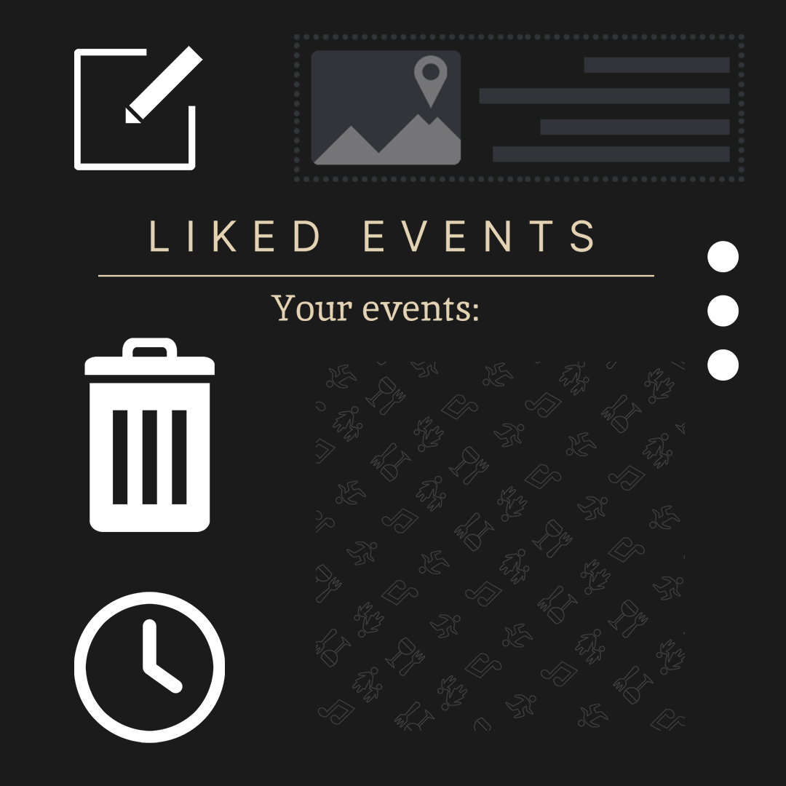
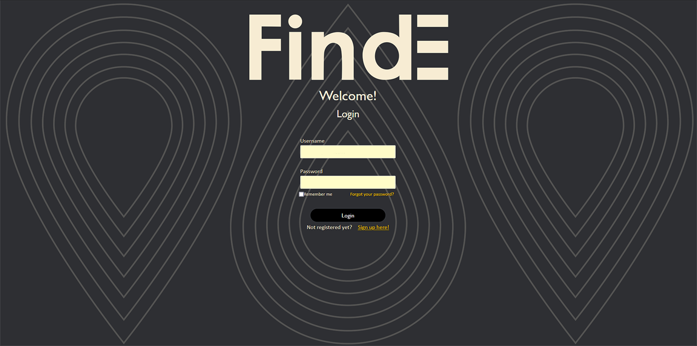
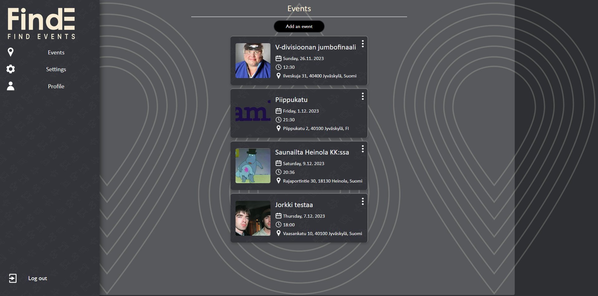
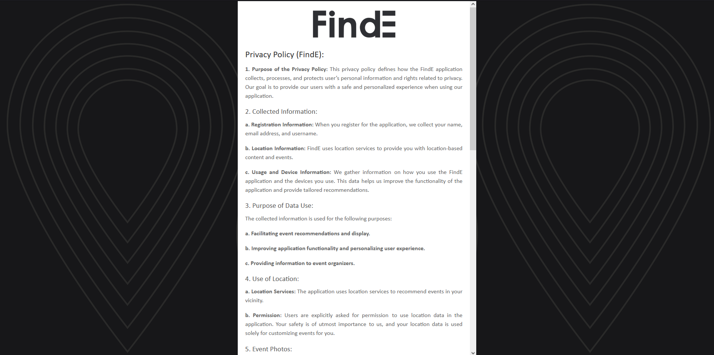

# Tietojenkäsittely

---

## Koulutus

### Tieto- ja viestintätekniikan perustutkinto [2014] - [2017]

**Gradia**

### Tietojenkäsittely Tradenomi [2021] - [2024]

**Jyväskylän ammattikorkeakoulu**

---
## Työkokemus

### [CSKeisari/Skinvault] - [2023] - [2024]

### Työtehtävät:

- Sisällön tekeminen usealle eri some alustalle
- Ideointia kansainvälisessä tiimissä

### [Alatar Oy] - [2021] - [2023]

### Työtehtävät:

- Sisällön editointia DaVinci Resolvella
- Yrityksen nettisivujen kääntämistä Englanniksi
- Some markkinointia

### [Säilykeherttua Oy] - [2018] - [2019]

### Työtehtävät:

- Sesonkityötä mm. Säilykkeiden valmistus sekä pakkaaminen
- Asiakaspalvelu

---

## Taidot

- Suunnittelu: Figma
- Frontend-kehitys: HTML, CSS, Svelte
- Kuvankäsittely: Adobe PhotoShop
- Video-editointi: Adobe Premiere, Adobe After Effects, DaVinci Resolve, CapCut
- Pilvipalvelut: AWS
- Työkalut: Git, VSCode

---

## Projektit

### [Ticorporate] - [2023/8] - [2023/12]

**Sisältö:**

Koulutusohjelmaan sisältyi 4 kuukautta kestävä softan kehitysprojekti, minkä ideana oli suunnitella ja toteuttaa toimiva prototyyppi sovelluksesta. Projekti tehtiin viiden hengen ryhmissä, missä hyödynnettiin Scrumin menetelmiä. Meidän ryhmämme teki tapahtumakarttasovelluksen (Find Events), jossa vastasin toisen ryhmän jäsenen kanssa UI/UX/Sisällöntuotannosta sekä liiketoiminnasta.

**Käytetyt työkalut:**

- Sovelluksen näkyvä puoli suunniteltiin hyödyntäen Figman graafista työkalua 
- Toteutus tehtiin Sveltellä (selainversio) sekä Angular/NativeScriptillä (mobiili)
- Sovellukselle tehtiin mainostusta varten graafista sisältöä hyödyntäen Adoben työkaluja
- Sovelluksen näkyvää puolta ja käytettävyyttä testattiin [kyselyllä]([https://www.example.com](https://forms.office.com/Pages/ResponsePage.aspx?id=8Kqebvc_6U2M1B_71FlRueKZbmRf2_pGlJwTys3gYsVUOTgwUDNJWEdFMkhKOThEMzZXRTIxQklMVS4u)) hyödyntäen Microsoft Formsia
**Saavutukset ja oppimiskokemukset:**

- Figman käyttäminen sovelluksen graafisessa suunnittelussa
- Svelten ja Angular/NativeScriptin käyttäminen graafisen puolen toteutuksessa
- Scrum käytänteiden hyödyntäminen laajassa opintojaksossa
- Markkinoinnin perusteet ja sometilien mahdollinen hyödyntäminen jatkokehityksessä

**Esimerkkejä visuaalisesta sisällöstä:**

### Sovelluksessa käytettyjä ikoneita:

### Selainversion näkymiä:

